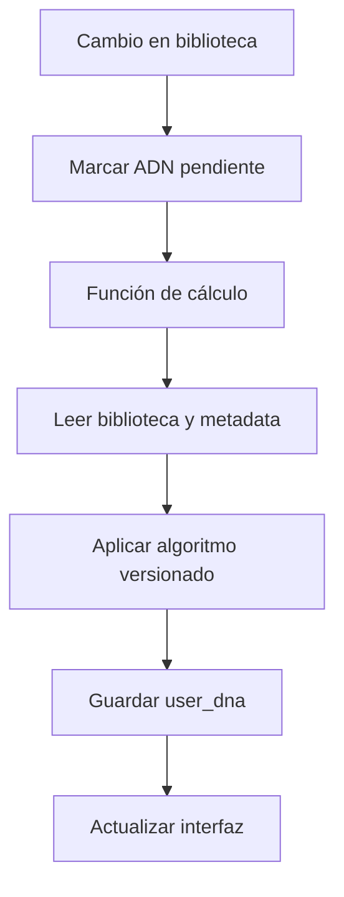

# Watchly — Módulo ADN Audiovisual

## 1. Propósito

Este documento define el diseño funcional y técnico del módulo **ADN Audiovisual** de Watchly.

El módulo transforma la biblioteca personal de cada usuario en un resumen visual de sus gustos. Debe ayudar a responder:

> ¿Qué dicen de vos las películas y series que elegís?

El ADN Audiovisual será la primera función de valor agregado posterior al MVP principal de Watchly. Debe implementarse como una experiencia simple, comprensible, compartible y sin depender inicialmente de inteligencia artificial paga.

---

## 2. Objetivos del producto

- Convertir los títulos cargados en una identidad audiovisual reconocible.
- Darle al usuario una recompensa por completar su biblioteca.
- Generar una pieza atractiva para compartir fuera de Watchly.
- Incentivar el regreso a la plataforma a medida que el ADN evoluciona.
- Diferenciar Watchly de una simple lista de películas y series.
- Preparar datos reutilizables para futuras funciones como compatibilidad, recomendaciones y retrospectivas anuales.

---

## 3. Principio central

El ADN debe ser **descriptivo**, no sentencioso.

Debe utilizar expresiones como:

- `Tu biblioteca se inclina por...`
- `Entre tus títulos aparecen con frecuencia...`
- `Según lo que registraste hasta ahora...`

Debe evitar afirmaciones psicológicas no justificadas como:

- `Sos una persona introvertida`.
- `Tenés una personalidad oscura`.
- `Tu inteligencia es superior`.

El resultado representa la biblioteca registrada en Watchly, no la personalidad completa del usuario.

---

## 4. Alcance de la primera versión

### Incluido

- Cálculo automático desde títulos registrados.
- Géneros principales.
- Distribución películas versus series.
- Décadas predominantes.
- Países de origen más frecuentes.
- Idiomas originales predominantes.
- Duración media de películas cuando el dato esté disponible.
- Calificación media personal.
- Tendencia de puntuación del usuario.
- Directores recurrentes cuando exista información suficiente.
- Actores recurrentes cuando exista información suficiente.
- Etiquetas de gusto generadas por reglas.
- Nivel de confianza del resultado.
- Fecha de última actualización.
- Página privada de detalle.
- Resumen dentro del perfil público.
- Tarjeta compartible.
- Opción de ocultar el ADN del perfil público.
- Recalcular cuando cambie la biblioteca.

### Fuera de esta etapa

- Recomendaciones personalizadas.
- Comparación entre usuarios.
- Compatibilidad entre perfiles.
- Interpretaciones generadas por modelos de lenguaje.
- Predicción de títulos que gustarán.
- Inferencias psicológicas.
- Clasificaciones competitivas entre usuarios.
- Resumen anual animado.

---

## 5. Condiciones de activación

El ADN no debe mostrarse como definitivo con muy pocos datos.

### Estados

| Títulos válidos | Estado | Comportamiento |
| ---: | --- | --- |
| 0–4 | `locked` | Mostrar progreso y explicar la función |
| 5–9 | `early` | Mostrar una vista preliminar claramente identificada |
| 10–24 | `developing` | Mostrar ADN completo con confianza media |
| 25–49 | `solid` | Mostrar ADN consolidado |
| 50 o más | `rich` | Mostrar ADN detallado y máxima variedad de insights |

### Definición de título válido

Para el cálculo inicial cuentan los registros con alguno de estos estados:

- `completed`.
- `watching`, únicamente para distribución entre películas y series y siempre que sea una serie.

No cuentan:

- `watchlist`.
- `dropped`.
- `paused`, salvo que en una versión futura se decida lo contrario.
- Títulos eliminados.

Los títulos privados sí pueden participar del cálculo personal. Sin embargo, sus nombres nunca deben revelarse en la versión pública.

---

## 6. Experiencia del usuario

### 6.1 Estado bloqueado

Cuando el usuario todavía no tenga cinco títulos válidos:

```text
Tu ADN Audiovisual está tomando forma

Agregá 5 títulos que hayas visto para descubrir los primeros rasgos de tu perfil.

3 de 5 títulos
[Agregar títulos]
```

La comunicación debe motivar sin presentar datos estadísticamente débiles.

### 6.2 ADN preliminar

Entre 5 y 9 títulos:

```text
Primeras señales de tu ADN

Por ahora, tu biblioteca se inclina hacia el thriller y las historias recientes.
Este resultado va a cambiar a medida que agregues más títulos.
```

Debe incluir la etiqueta `ADN preliminar`.

### 6.3 ADN completo

A partir de 10 títulos:

- Encabezado personal.
- Frase resumen.
- Visual principal de géneros.
- Tarjetas de indicadores.
- Bloques de décadas, países e idioma.
- Tendencia de calificación.
- Creadores recurrentes si corresponde.
- Explicación de metodología.
- Botón para compartir.

### 6.4 Evolución

Cuando el ADN cambie de manera relevante:

```text
Tu ADN cambió

El drama pasó a ser uno de tus tres géneros principales.
```

No se requiere notificación push en esta etapa. El cambio se puede mostrar dentro de la aplicación.

---

## 7. Ubicación dentro de Watchly

### Ruta privada

```text
/adn
```

### Perfil público

Incluir un bloque resumido:

```text
ADN Audiovisual
Thriller · Drama · Ciencia ficción
Década dominante: 2010
[Ver ADN completo]
```

### Ruta pública

```text
/@:username/adn
```

La ruta pública solo existe si:

- El perfil es público.
- El usuario activó `show_dna_publicly`.
- El ADN tiene al menos estado `early`.

---

## 8. Información mostrada

### 8.1 Frase resumen

Ejemplo:

> Tu biblioteca combina tensión, mundos imaginarios y relatos intensos. Te inclinás por producciones recientes, pero también volvés con frecuencia a los clásicos de los 90.

La primera versión debe generarse mediante plantillas y reglas, no mediante IA generativa.

### 8.2 Géneros principales

- Mostrar los cinco géneros con mayor peso.
- Destacar visualmente los tres primeros.
- Mostrar porcentaje relativo.
- Permitir ver el listado completo.

Ejemplo:

```text
Thriller             29%
Drama                24%
Ciencia ficción      18%
Comedia              16%
Crimen               13%
```

### 8.3 Películas versus series

```text
Películas 68% · Series 32%
```

Debe basarse en la cantidad de títulos, no en horas vistas, porque el seguimiento de horas puede ser incompleto.

### 8.4 Décadas

Agrupar por año de estreno:

```text
Antes de 1980
1980
1990
2000
2010
2020
```

Mostrar hasta tres décadas principales.

### 8.5 Países de origen

- Mostrar hasta cinco países.
- Utilizar nombres localizados.
- No reemplazar país de origen por país de producción cuando haya varios: cada producción puede aportar peso fraccionado.

Ejemplo: una coproducción Argentina–España aporta `0.5` a cada país.

### 8.6 Idiomas originales

Mostrar los tres idiomas más frecuentes cuando exista variedad suficiente.

### 8.7 Duración

Para películas terminadas con runtime disponible:

- Duración media.
- Preferencia orientativa: corta, media o larga.

Rangos:

```text
Hasta 95 minutos       Historias compactas
96–130 minutos         Duración intermedia
Más de 130 minutos     Historias extensas
```

No calcular duración total de series en esta etapa.

### 8.8 Calificaciones personales

- Promedio del usuario.
- Mediana.
- Porcentaje de títulos puntuados.
- Distribución de estrellas.

La etiqueta de tendencia se calcula únicamente con un mínimo de 10 títulos puntuados:

```text
Promedio >= 4.2     Entusiasta
3.6–4.19            Generoso
2.8–3.59            Selectivo
< 2.8               Exigente
```

Estas etiquetas deben presentarse con tono lúdico y una explicación visible. No deben implicar superioridad.

### 8.9 Creadores recurrentes

Mostrar directores y actores solamente cuando:

- Aparezcan en al menos 3 títulos válidos.
- La metadata esté disponible.
- No provengan exclusivamente de una misma serie con múltiples registros relacionados.

Máximo visible:

- 3 directores.
- 5 actores.

### 8.10 Etiquetas de gusto

Mostrar entre 2 y 4 etiquetas construidas con reglas:

- `Explorador de géneros`.
- `Amante de los clásicos`.
- `En modo estreno`.
- `Maratonista de series`.
- `Más cine que series`.
- `Historias sin fronteras`.
- `Fan de los relatos extensos`.
- `Busca emociones fuertes`.
- `Curador exigente`.
- `Entusiasta audiovisual`.

Las condiciones exactas se definen en la sección de reglas.

---

## 9. Modelo de cálculo

### 9.1 Principio

El ADN debe calcularse de manera determinista: con los mismos datos de entrada debe producir el mismo resultado.

### 9.2 Peso por estado

```text
completed = 1.0
watching  = 0.5, únicamente para series
```

### 9.3 Peso por calificación

La calificación modifica levemente la importancia de un título:

```text
sin puntuación = 1.00
0.5–2.0        = 0.70
2.5–3.0        = 0.90
3.5            = 1.00
4.0            = 1.15
4.5            = 1.30
5.0            = 1.50
```

Fórmula:

```text
title_weight = status_weight × rating_weight
```

La ponderación es moderada para representar tanto lo que el usuario consume como lo que más valora.

### 9.4 Géneros múltiples

Si un título tiene varios géneros, su peso se distribuye de forma equitativa:

```text
genre_contribution = title_weight / genre_count
```

Ejemplo: un título con peso `1.2` y tres géneros aporta `0.4` a cada uno.

### 9.5 Porcentaje de género

```text
genre_percentage = genre_weight / total_genre_weight × 100
```

Los porcentajes visibles deben redondearse asegurando que la suma mostrada sea coherente.

### 9.6 Países e idiomas

- Los países de coproducciones comparten el peso del título.
- Se usa el idioma original informado por la fuente audiovisual.
- Los valores desconocidos no deben convertirse en `Otros`; se excluyen y se muestra cobertura.

### 9.7 Recencia

En la primera versión, un título visto recientemente no pesa más que uno antiguo. La fecha de consumo podrá incorporarse en una versión posterior para mostrar evolución sin distorsionar el ADN general.

---

## 10. Reglas para etiquetas

Las reglas deben vivir en configuración versionada y poder ajustarse sin modificar componentes visuales.

### Explorador de géneros

```text
Al menos 8 géneros con participación >= 5%
```

### Amante de los clásicos

```text
Al menos 30% de títulos anteriores al año 2000
y al menos 10 títulos válidos
```

### En modo estreno

```text
Al menos 50% de títulos estrenados en los últimos 3 años
y al menos 10 títulos válidos
```

### Maratonista de series

```text
Series >= 60% de los títulos válidos
y al menos 10 títulos válidos
```

### Más cine que series

```text
Películas >= 70% de los títulos válidos
y al menos 10 títulos válidos
```

### Historias sin fronteras

```text
Al menos 6 países con participación >= 5%
y al menos 15 títulos con país disponible
```

### Fan de los relatos extensos

```text
Runtime medio de películas > 130 minutos
y al menos 8 películas con runtime disponible
```

### Busca emociones fuertes

```text
La suma de thriller + terror + crimen + acción >= 45%
y al menos 10 títulos válidos
```

### Curador exigente

```text
Rating promedio < 2.8
y al menos 10 títulos puntuados
```

### Entusiasta audiovisual

```text
Rating promedio >= 4.2
y al menos 10 títulos puntuados
```

Si varias reglas califican, elegir un máximo de cuatro priorizando diversidad: consumo, época, geografía y puntuación.

---

## 11. Generación de la frase resumen

### Estructura

```text
[Apertura por géneros]. [Rasgo de formato o época]. [Rasgo adicional opcional].
```

### Plantillas de apertura

```text
Tu biblioteca combina {genre_1}, {genre_2} y {genre_3}.
Tus elecciones se mueven entre {genre_1}, {genre_2} y {genre_3}.
En tu pantalla predominan {genre_1}, {genre_2} y {genre_3}.
```

### Plantillas de formato

```text
Te inclinás especialmente por las películas.
Las series ocupan el centro de tu biblioteca.
Mantenés un equilibrio entre películas y series.
```

### Plantillas de época

```text
Las producciones de los {decade} son las que más se repiten.
Tu selección mira especialmente hacia los estrenos recientes.
Los clásicos tienen un lugar importante en tu perfil.
```

### Reglas editoriales

- Máximo 240 caracteres.
- No repetir el mismo concepto.
- No mencionar un dato con cobertura insuficiente.
- Utilizar el idioma configurado por el usuario.
- Mantener tono cercano, no clínico.

---

## 12. Confianza y cobertura

### Confidence score

Calcular un valor de 0 a 100 considerando:

- Cantidad de títulos válidos: 50%.
- Cobertura de metadata: 30%.
- Porcentaje de títulos puntuados: 20%.

Ejemplo de fórmula:

```text
quantity_score = min(valid_titles / 50, 1) × 50
metadata_score = metadata_coverage × 30
rating_score   = rated_titles / valid_titles × 20
confidence     = round(quantity_score + metadata_score + rating_score)
```

### Etiquetas visibles

```text
0–24    Inicial
25–49   En desarrollo
50–74   Consistente
75–100  Muy representativo
```

El usuario debe poder leer:

> Este ADN se calcula con 32 títulos y seguirá cambiando cuando actualices tu biblioteca.

---

## 13. Diseño visual

### Concepto

El ADN debe sentirse como una huella audiovisual viva. No utilizar una representación literal de ADN médico.

### Visual principal recomendado

Un conjunto de bandas, ondas o arcos concéntricos cuyo tamaño y color representen los géneros principales.

- Utilizar el color de acento del perfil como punto de partida.
- Generar tonos complementarios mediante una paleta controlada.
- Mantener contraste correcto en light y dark.
- No depender solamente del color: acompañar con nombre y porcentaje.

### Componentes

```text
DNAHero
DNASummary
GenreFingerprint
FormatBalance
DecadeDistribution
CountryMapSummary
LanguageSummary
RatingPersonality
RecurringCreators
DNATags
DNAConfidence
DNAShareCard
DNAEmptyState
```

### Responsive

- En mobile, una columna y gráficos simplificados.
- En desktop, grilla de 12 columnas.
- La tarjeta compartible debe mantener legibilidad a tamaño reducido.

---

## 14. Tarjeta compartible

### Formatos

Generar como mínimo:

- Historia: `1080 × 1920 px`.
- Feed vertical: `1080 × 1350 px`.
- Open Graph: `1200 × 630 px`.

### Contenido

- Marca Watchly.
- Avatar opcional.
- Nombre visible y username.
- Frase `Mi ADN Audiovisual`.
- Tres géneros principales.
- Visual de huella.
- Dos etiquetas destacadas.
- Cantidad de títulos analizados.
- URL corta o QR opcional en una etapa posterior.

### Privacidad

- Nunca mostrar títulos privados.
- No mostrar email, ubicación ni información de cuenta.
- Permitir descargar sin publicar el ADN en el perfil.

### CTA

```text
Descubrí qué dice tu biblioteca en Watchly
```

---

## 15. Datos requeridos de la API audiovisual

Por cada película o serie se recomienda almacenar o poder recuperar:

```text
external_id
media_type
title
release_date o first_air_date
genre_ids / genres
original_language
origin_country / production_countries
runtime para películas
episode_run_time opcional para series
director_ids / directors
top_cast_ids / top_cast
```

Si Watchly cambia de proveedor audiovisual, el algoritmo debe usar el modelo normalizado interno y no campos específicos de una API.

---

## 16. Cambios en el modelo de datos

### Ampliación de `watchly.media`

Agregar o asegurar los siguientes campos:

```text
runtime integer
original_language text
origin_countries jsonb not null default '[]'
directors jsonb not null default '[]'
top_cast jsonb not null default '[]'
metadata_updated_at timestamptz
```

### Ampliación de `watchly.profiles`

```text
show_dna_publicly boolean not null default true
```

### Nueva tabla `watchly.user_dna`

```text
id uuid primary key default gen_random_uuid()
user_id uuid not null unique references auth.users(id) on delete cascade
status text not null
algorithm_version integer not null
valid_title_count integer not null default 0
rated_title_count integer not null default 0
confidence_score integer not null default 0
summary text
top_genres jsonb not null default '[]'
format_distribution jsonb not null default '{}'
decade_distribution jsonb not null default '[]'
country_distribution jsonb not null default '[]'
language_distribution jsonb not null default '[]'
runtime_profile jsonb not null default '{}'
rating_profile jsonb not null default '{}'
recurring_directors jsonb not null default '[]'
recurring_cast jsonb not null default '[]'
tags jsonb not null default '[]'
source_updated_at timestamptz
calculated_at timestamptz not null default now()
created_at timestamptz not null default now()
updated_at timestamptz not null default now()
```

### Historial opcional

No crear historial completo en la primera implementación. Se puede añadir más adelante:

```text
watchly.user_dna_snapshots
```

Esto permitirá visualizar cómo cambió el ADN a lo largo del tiempo.

---

## 17. Arquitectura de cálculo

### Recomendación

Calcular el ADN en una Supabase Edge Function o función SQL segura, nunca únicamente en el navegador.

### Flujo



### Disparadores

Marcar el ADN para recalcular cuando:

- Se agrega un título.
- Cambia el estado.
- Cambia la puntuación.
- Se elimina un título.
- Se actualiza metadata relevante.

### Estrategia de ejecución

Para el MVP del módulo:

- Recalcular de forma asíncrona después de un cambio.
- Evitar más de un cálculo por usuario dentro de una ventana de 30 segundos.
- Permitir recalculado manual si el resultado quedó desactualizado.
- Guardar `algorithm_version` para recalcular resultados cuando cambien las reglas.

### Endpoint sugerido

```text
POST /functions/v1/calculate-user-dna
GET  /rest/v1/user_dna?user_id=eq.{id}
```

El endpoint de cálculo debe ignorar un `user_id` arbitrario enviado por el cliente y utilizar el usuario autenticado, salvo procesos internos autorizados.

---

## 18. Seguridad y RLS

### `watchly.user_dna`

- El propietario puede leer su ADN completo.
- El propietario puede actualizar únicamente preferencias relacionadas mediante operaciones controladas.
- El cálculo se escribe desde una función segura.
- Un visitante puede leer el ADN solo si el perfil es público y `show_dna_publicly = true`.
- El visitante nunca recibe referencias a títulos privados.
- No permitir escrituras directas del cliente sobre resultados calculados.

### Prevención de manipulación

- La función debe leer las calificaciones desde la base de datos.
- No aceptar porcentajes o etiquetas calculados por el frontend.
- Validar `algorithm_version`.
- Registrar errores sin exponer contenido privado.

---

## 19. API y tipos sugeridos

```ts
type DNAStatus = 'locked' | 'early' | 'developing' | 'solid' | 'rich';

interface WeightedMetric {
  key: string;
  label: string;
  weight: number;
  percentage: number;
}

interface UserDNA {
  status: DNAStatus;
  algorithmVersion: number;
  validTitleCount: number;
  ratedTitleCount: number;
  confidenceScore: number;
  summary: string | null;
  topGenres: WeightedMetric[];
  formatDistribution: {
    movie: number;
    tv: number;
  };
  decadeDistribution: WeightedMetric[];
  countryDistribution: WeightedMetric[];
  languageDistribution: WeightedMetric[];
  runtimeProfile: {
    averageMinutes: number | null;
    label: string | null;
    coverage: number;
  };
  ratingProfile: {
    average: number | null;
    median: number | null;
    distribution: Record<string, number>;
    label: string | null;
    coverage: number;
  };
  recurringDirectors: CreatorMetric[];
  recurringCast: CreatorMetric[];
  tags: string[];
  calculatedAt: string;
}
```

---

## 20. Estados de interfaz

### Cargando

- Skeleton del hero.
- Skeleton de tarjetas.
- Mensaje `Estamos leyendo tu biblioteca` solo en el primer cálculo.

### Sin suficientes títulos

- Barra de progreso.
- CTA para agregar títulos.
- Explicación breve del beneficio.

### Metadata incompleta

Mostrar el ADN con aviso:

> Algunos datos todavía no están disponibles. Tu ADN se completará automáticamente.

### Error

```text
No pudimos actualizar tu ADN en este momento.
[Volver a intentar]
```

### Desactualizado

Mostrar el último resultado disponible y un indicador discreto de actualización.

---

## 21. Analítica

Eventos:

```text
dna_locked_viewed
dna_unlocked
dna_viewed
dna_recalculated
dna_share_started
dna_share_completed
dna_public_visibility_changed
dna_profile_clicked
```

Propiedades permitidas:

```text
dna_status
valid_title_count_bucket
confidence_bucket
share_format
```

No enviar a analítica:

- Listado de títulos.
- Calificaciones individuales.
- Nombres de creadores.
- Resumen personalizado completo.
- Identidad sensible del usuario.

---

## 22. Métricas de éxito

- Porcentaje de usuarios elegibles que visitan su ADN.
- Incremento de títulos agregados después de ver el estado bloqueado.
- Porcentaje que comparte la tarjeta.
- Visitas públicas generadas por tarjetas compartidas.
- Frecuencia de regreso a `/adn`.
- Porcentaje que mantiene el ADN visible públicamente.
- Incremento en completitud de calificaciones.

Objetivo inicial recomendado:

```text
Al menos 20% de los usuarios con ADN desbloqueado inicia una acción de compartir.
```

---

## 23. Accesibilidad

- Todo gráfico debe tener una alternativa textual.
- No comunicar proporciones únicamente con color.
- Etiquetas y porcentajes legibles con lectores de pantalla.
- Navegación completa mediante teclado.
- Contraste WCAG AA en todos los acentos.
- Respetar `prefers-reduced-motion`.
- La tarjeta compartible debe mantener tamaño mínimo de texto legible.

---

## 24. Criterios de aceptación

El módulo se considera terminado cuando:

1. Un usuario con menos de 5 títulos ve un estado bloqueado con progreso correcto.
2. Con 5 títulos válidos se genera un ADN preliminar.
3. Con 10 títulos válidos se genera la vista completa.
4. Los géneros se ponderan y normalizan correctamente.
5. Películas y series se distribuyen por cantidad de títulos.
6. Las décadas se calculan desde las fechas de estreno disponibles.
7. Las coproducciones distribuyen su peso entre países.
8. La puntuación modifica el peso sin dominar el resultado.
9. Las etiquetas solo aparecen cuando cumplen su regla.
10. La frase resumen se genera sin IA y no supera 240 caracteres.
11. El resultado incluye un nivel de confianza.
12. Un cambio relevante en biblioteca marca el ADN para recalcular.
13. El cálculo no puede ejecutarse para otro usuario desde el frontend.
14. El perfil privado no expone el ADN.
15. La preferencia `show_dna_publicly` funciona correctamente.
16. Los títulos privados pueden influir en el resultado agregado sin revelar sus nombres.
17. El ADN funciona en light y dark.
18. Respeta el color de acento del perfil.
19. La vista funciona en mobile y desktop.
20. Se puede generar y descargar una tarjeta compartible.
21. Los gráficos tienen equivalentes textuales accesibles.
22. El algoritmo guarda su versión.
23. El resultado anterior permanece disponible durante un recálculo.
24. Los errores permiten volver a intentar sin perder información.

---

## 25. Pruebas mínimas

### Unitarias

- Distribución de géneros múltiples.
- Peso por estado.
- Peso por rating.
- Décadas.
- Coproducciones.
- Mediana y promedio.
- Selección de etiquetas.
- Confidence score.
- Generación de resumen.
- Redondeo de porcentajes.

### Integración

- Cambio en `user_media` dispara recálculo.
- RLS privada y pública.
- Metadata faltante.
- Usuario sin calificaciones.
- Usuario solo con películas.
- Usuario solo con series.
- Cambio de versión del algoritmo.

### Visuales

- Dark y light.
- Todos los acentos disponibles.
- Mobile pequeño.
- Textos largos y traducciones.
- Tarjetas de los tres formatos.

---

## 26. Plan de implementación

### Paso 1 — Preparar datos

- Auditar metadata disponible.
- Normalizar géneros, países, idiomas, runtime y creadores.
- Crear migración de campos faltantes.
- Crear `watchly.user_dna`.

### Paso 2 — Algoritmo

- Implementar funciones puras de cálculo.
- Versionar como `algorithm_version = 1`.
- Crear tests unitarios.
- Validar con bibliotecas ficticias pequeñas, medianas y grandes.

### Paso 3 — Backend

- Crear función de cálculo.
- Implementar marcado de ADN pendiente.
- Configurar debounce del recálculo.
- Crear políticas RLS.

### Paso 4 — Interfaz

- Crear estado bloqueado y preliminar.
- Crear dashboard completo.
- Integrar bloque en perfil público.
- Crear configuración de visibilidad.

### Paso 5 — Compartir

- Implementar tarjeta de Historia.
- Implementar feed vertical y Open Graph.
- Añadir descarga y compartir.

### Paso 6 — QA

- Revisar cálculos.
- Probar privacidad.
- Probar accesibilidad.
- Probar mobile y desktop.
- Validar analítica.

---

## 27. Decisiones adoptadas

- Se implementará una sola función de valor agregado por etapa.
- El ADN Audiovisual será la primera.
- El algoritmo inicial será determinista y no dependerá de IA generativa.
- Se desbloquea preliminarmente con 5 títulos y se consolida desde 10.
- Las puntuaciones tendrán influencia moderada.
- El visitante verá resultados agregados, nunca nombres de títulos privados.
- El usuario controlará la visibilidad pública del ADN.
- La experiencia utilizará el tema y acento visual de cada perfil.
- El resultado será compartible desde la primera versión.
- El modelo quedará preparado para compatibilidad entre perfiles en una etapa futura.

---

## 28. Mejoras futuras del módulo

No implementar en esta etapa:

- Evolución mensual del ADN.
- Comparación del ADN entre años.
- Compatibilidad entre dos perfiles.
- ADN conjunto de pareja o grupo.
- Recomendaciones derivadas del ADN.
- Explicaciones generadas con IA.
- Insignias por exploración de países, épocas o géneros.
- Animación anual tipo créditos finales.

Estas funciones deberán reutilizar `user_dna` y mantener compatibilidad con versiones anteriores del algoritmo.

